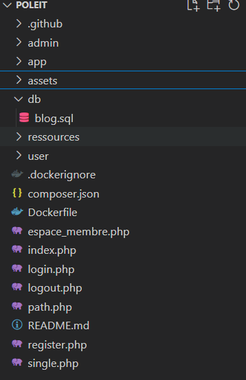

# POLE-IT Valenciennes:

# 1-La Partie WEB :

**A -structure  de mes dossiers** :



**B-Explication de mes dossiers et fichiers php:**

1- le dossier .**github** contient essentiellement les fichier de workflow  1


2- le dossier **admin** : contient  4 autre  sous dossiers qui contiennent les fichier PHP espace administrateur et Dashboard  et les fonctionnalité de création et modification des topic et messages et post   


3-Le dossier **app** : contient a son tour 4 sous dossier d’ont le dossier  Controller qui contient les fichiers qui gère le accès et le data base qui contient le fichier de connexion a base de donne le dossier Includes contient a lui les Nav barre

  


4- le dossier  **asset** : il contient tous fichier css et les images des poste 


5- le dossier **db** : contient mon fichier sql

6-le dossier **ressources** : contient les images du site  

7-le  dossiers **user** : contient les fichier de  espaces utilisateur 

8-les autre fichiers :  c’est les fichier de  la pages home et de connexion et déconnexion 

### Création de Docker file:

```docker
FROM php:8.2-apache
```

```docker
RUN docker-php-ext-install mysqli pdo pdo_mysql
```

```docker
COPY . /var/www/html
RUN chown -R www-data:www-data /var/www/html/
EXPOSE 80
```

**Explication du Docker file :**

**1. FROM php:8.2-apache:** Docker sera construit une image a partir de  `php:8.2-apache`. 

**2. RUN docker-php-ext-install mysqli pdo pdo_mysql:**Cette instruction installe des extensions PHP de on a besoin 

**3. COPY . /var/www/html**

 copie tout le contenu de votre répertoire de travail actuel  vers le répertoire `/var/www/html` à l'intérieur de votre conteneur

**4. RUN chown -R www-data:www-data /var/www/html/**

Cette instruction change le propriétaire du répertoire `/var/www/html` et de son contenu à l'utilisateur `www-data`. octroie  les permissions d'accès aux fichiers 

**5. EXPOSE 80 :**expose sur le port 80

**Pour avoir image docker et push sur docker hub** 

```docker
 docker build -t pole-it:0.4 .
 docker tag pole-it:0.4 idir2012/img-pole-it:0.4
 docker push
```

### Création de docker compose:

on crée un docker compose comme suit  dans le but de test  simplement  de notre  site avant le déploiement sur  Kubernetes :

```yaml
version: "3.8"

services:
  php:
    build:
      context: .
      dockerfile: Dockerfile
    container_name: php_app
    environment:
      DB_HOST: mysql
      DB_USER: root
      DB_PASSWORD: root
      DB_NAME: blog
    ports:
      - "9000:80"
    volumes:
      - .:/var/www/html
    depends_on:
      - db

  db:
    image: mysql:8.0-debian
    container_name: mysql
    restart: always
    environment:
      MYSQL_ROOT_PASSWORD: root
      MYSQL_DATABASE: blog
      MYSQL_ROOT_USER: root
      MYSQL_PASSWORD: root
    ports:
      - "3307:3306"
    volumes:
      - db_data:/var/lib/mysql
      - ./db/blog.sql:/opt/blog.sql:ro
volumes:
  db_data:

```

# 2-La Partie Infrastructure et déploiement:

## A- Infrastructure:

**1**.**Schéma de mon infrastructure kubernetes :**


**2**.**Schéma et adressage de mon cluster** 


**Lien vers schéma:**

[https://lucid.app/lucidspark/00e443b6-83fd-4d54-b072-d5452f4523d9/edit?invitationId=inv_b1fa5457-7da0-4d7e-b678-99f8842e7816&page=0_0#](https://lucid.app/lucidspark/00e443b6-83fd-4d54-b072-d5452f4523d9/edit?invitationId=inv_b1fa5457-7da0-4d7e-b678-99f8842e7816&page=0_0#)

## B -Déploiement du  Cluster :

Une fois installation de  OS Debian est termine on doit attribuer les adresses IP statique a nos VM

en modifiant le ficher de configuration avec la commande:

```bash
vim /etc/network/interfaces
```

### 1- installation de K3S :

 on ouvre dans navigateur  la page [https://docs.k3s.io/quick-start](https://docs.k3s.io/quick-start)

puis on tape la commande:

```jsx
curl -sfL [https://get.k3s.io](https://get.k3s.io/) | sh -
```

une fois installé  on cherche le Token :

```jsx
cat /var/lib/rancher/k3s/server/node-token
```

**A noter :**

Le contrôleur Ingress vient par défaut dans pack 3Ks est Traefik est déjà installé

### 2- Ajouter des Nodes :

 Pour les ajouter Vm2 et Vm3 aux cluster  on tape la commande ci dessus  on lui donnant  IP   du master et le Token  que on copier du master

```jsx
curl -sfL [https://get.k3s.io](https://get.k3s.io/) | K3S_URL=https://192.168.176.120:6443 K3S_TOKEN=K10e1727a992017e4c17ca9345e565efd7b6fe0508b0c8fb5fbd78e40714c63ef48::server:88bb5d7e08e662b1d44f2d178950c7ff sh -
```

et on peut vérifie si il ajouter dans le cluster  on tapant la commande dans le master  

```jsx
kubectl get nodes
```

`résultat` :


### 4-**Mes Fichiers YAML de Kubernetes :**

**A noter** :

Avant de commencer  a rédiger mes **fichiers** on doit copier le le contenu du fichier de configuration de 3Ks  qui se trouve dans `/etc/rancher/k3s/k3s.yaml`dans notre ficher de conf kube de notre machine physique  qui se trouve  dans mon cas  "C:\Users\agour\.kube\config”

### A -Création  des fichiers de BD :

### A- Création du Pvc de Mysql :

on crée notre fichier comme ci dessus:

```yaml
apiVersion: v1
kind: PersistentVolumeClaim
metadata:
  name: mysql-volume
spec:
  accessModes:
    - ReadWriteOnce
  resources:
    requests:
      storage: 5Gi
```

 **Explication du ficher :**

**`apiVersion`**: Indique la version de l'API Kubernetes  ****

**`kind`**: Indique le type de ressource Kubernetes , Dans ce cas, il s'agit d'un `PersistentVolumeClaim`.

**`metadata`**: Contient des informations générales sur le PVC

**`name: mysql-volume`**: Le nom unique attribué à ce PVC

**`spec`**: Définit les caractéristiques du stockage demandé par le PVC.

**`accessModes`**: il indiquant les modes d'accès pour le volume persistant. 

`ReadWriteOnce`ce qui signifie qu'un seul Pod peut monter le volume en lecture-écriture à la fois.

**`resources`**: Un objet qui définit les ressources demandées par le PVC.

**`requests`**: Un objet qui définit les ressources de stockage minimum requises par le PVC.

**`storage: 5Gi`**: La quantité de stockage demandée 5 Gi

**application du fichier:**  

on le applique avec la commande :

```yaml
kubectl apply -f .\pvc_mysql.yaml
```

**et pour vérification** : 

```yaml
kubectl get pvc
```

 **résultat** :


Création du Secret de MYSQL

```jsx
apiVersion: v1
kind: Secret
metadata:
  name: mysql-secret
type: Opaque
data:
  password: cm9vdA== # "root" encodé en base64
  MYSQL_ROOT_PASSWORD: cm9vdA== #root
  MYSQL_DATABASE:  YmxvZwo= #blog
```

**Explication du ficher**

- **`apiVersion`** : Indique la version de l'API Kubernetes
- **`kind`** : Indique le type de ressource Kubernetes, Dans ce cas, il s'agit d'un `Secret`.
- **`metadata`** : Contient des informations générales sur le Secret
- **`type`** : Indique le type de données stockées dans le Secret.
- `Opaque` signifie que les données sont traitées comme un bloc binaire et ne sont pas interprétées par Kubernetes
- **`data`** :
elle contient les variables de environnement  encodé en
base64 :
- A noter pour mettre en base64 on tape la commande

```jsx
echo  -n "mavariable" | base64
```

**application du fichier:**  

on le applique avec la commande :

```yaml
kubectl apply -f .\secret-mysql.yaml
```

**Résultat** :


### C -Création du Service de MYSQL:

```jsx
apiVersion: v1
kind: Service
metadata:
  name: mysql
spec:
  selector:
    app: mysql-app
  ports:
    - protocol: TCP
      port: 3306
      
```

**Explication du ficher:**

- **`apiVersion`** : Indique la version de l'API Kubernetes
- **`kind`** : Indique le type de ressource Kubernetes , il s'agit d'un `Service`.
- **`metadata`** : Contient des informations générales sur le Service.
- **`spec`** : Définit la configuration du Service.
    
    **`selector`** : Un objet qui spécifie les Pods auxquels ce Service doit acheminer le
    trafic. Dans ce cas, le Service sélectionne les Pods avec l'étiquette `app: mysql-app`
    
    **`ports`** :
    
    - **`protocol: TCP`** : Indique que le trafic sera acheminé sur le protocole TCP.
    - **`port: 3306`** : Le port sur lequel le Service sera accessible. Les Pods clients se
    connecteront à ce port pour accéder à l'application MYSQL.
    
    **Application du fichier:**  
    
    on le applique avec la commande :
    
    ```yaml
    kubectl apply -f .\service_mysql.yaml
    ```
    
    **résultat:**
    
    
    
    ### D-  Création du Déploiement de Mariadb:
    
    ```yaml
    apiVersion: apps/v1
    kind: Deployment
    metadata:
      name: mysql-app
    spec:
      replicas: 1
      selector:
        matchLabels:
          app: mysql-app
      template:
        metadata:
          labels:
            app: mysql-app
        spec:
          containers:
          - name: container-mysql
            image: mysql:8.0-debian
            envFrom:
            - secretRef:
                name: mysql-secret
            volumeMounts:
            - mountPath: /var/lib/mysql
              name: mysql-volume
            ports:
            - containerPort: 3306
            resources:
              limits:
                memory: "512Mi"
                cpu: "1000m"
              requests:
                memory: "256Mi"
                cpu: "500m"
          volumes:
          - name: mysql-volume
            persistentVolumeClaim:
              claimName: mysql-volume
    ```
    
    **Explication du ficher:**
    
    - **`apiVersion`** : Indique la version de l'API Kubernetes
    - **`kind`** : Indique le type de ressource Kubernetes , il s'agit d'un `Deployment`.
    - **`spec`** : Définit la configuration du Deployment.
        
        **`replicas: 1`** : Indique le nombre de réplicas de Pods 
        
        **`template`** : Un modèle de Pod utilisé pour créer des réplicas.
        
        **`spec`** : Définit la configuration des Pods créés à partir du modèle :
        
        **`containers`** : Un tableau qui définit les conteneurs à exécuter dans les Pods :
        
        **`name: container-mysql`** : Le nom du conteneur.
        
        **`image: mysql:8:0 debian`** : L'image .
        
        **`envFrom`**  variables d'environnement stockées dans le Secret `mysql-secret` 
        
        **`volumeMounts`** :  définit les volumes à monter dans le conteneur et les
        chemins de montage correspondants. Ici, un volume persistant est monté
        sur le chemin `/var/lib/mysql` dans le conteneur.
        
        **`volumes`** : Un tableau qui définit les volumes à attacher aux Pods :**`name: mysql-volume`**
        
        **`volume`** : Le nom du volume persistant.
        
        **`persistentVolumeClaim`** :  PersistentVolumeClaim utilisée pour monter le volume.
        
        **`claimName: mysql-volume`** : Le nom du PersistentVolumeClaim correspond
        
        `resources`
        Cette section définit les ressources allouées au conteneur.
        
        - `limits` : Les limites maximales de ressources.
            - `memory: "512Mi"` : Limite de mémoire de 512 MiB.
            - `cpu: "1000m"` : Limite de CPU de 1000 milliCPU (1 CPU).
        - `requests` : Les ressources demandées.
            - `memory: "256Mi"`
            - `cpu: "500m"`
        
        **application du fichier:**  
        
        on le applique avec la commande :
        
        ```yaml
        kubectl apply -f .\deployment_mysql.yaml
        ```
        
        **résultats :**
        
        
        
        
        
        ## ***Déploiement de Pole-it:***
        
        ### A- Création du Pvc de Polei-t :
        
        ```yaml
        apiVersion: v1
        kind: PersistentVolumeClaim
        metadata:
          name: pole-it-pvc
        spec:
          accessModes:
          - ReadWriteOnce
          resources:
            requests:
              storage: 1Gi
        ```
        
        **Explication du ficher:**
        
        c’est le même fichier Yaml que pvc 
        
         **application du fichier:**  
        
        on le applique avec la commande :
        
        ```yaml
        kubectl apply -f .\Pvc_pole_it
        ```
        
        **et pour vérification :**
        
        
        
        ### B- Création du Service de Pole-it:
        
        ```yaml
        apiVersion: v1
        kind: Service
        metadata:
          name: poleit-app
        spec:
          selector:
            app: poleit-app
          ports:
            - protocol: TCP
              port: 80
        ```
        
        **Explication du ficher:**
        
        - **`apiVersion`** : Indique la version de l'API Kubernetes
        - **`kind`** : Indique le type de ressource Kubernetes , il s'agit d'un `Service`.
        - **`metadata`** : Contient des informations générales sur le Service.
        - **`spec`** : Définit la configuration du Service.
        - `ports:` : Ceci définit la manière dont le service expose l'application exécutée dans les pods.
            - `protocol: TCP` : Ceci spécifie le protocole utilisé pour la communication
            - `port: 80` : Ceci définit le port externe sur lequel le service sera accessible
        
        **application du fichier:**  
        
        on le applique avec la commande :
        
        ```yaml
        kubectl apply -f .\service_poleit
        
        ```
        
        
        
        ### D- Création du Déploiement de Pole-it:
        
        ```yaml
        apiVersion: apps/v1
        kind: Deployment
        metadata:
          name: poleit-app
        spec:
          replicas: 3
          selector:
            matchLabels:
              app: poleit-app
          template:
            metadata:
              labels:
                app: poleit-app
            spec:
              containers:
              - name: poleit-app
                image: adlalkheraz/poleit:latest
                env:
                  - name: DB_HOST
                    value: "mysql"
                  - name: DB_USER
                    value: "root"
                  - name: DB_PASSWORD
                    valueFrom:
                      secretKeyRef:
                        name: mysql-secret
                        key: password
                  - name: DB_NAME
                    value: "blog"
                ports:
                - containerPort: 80
                volumeMounts:
                  - name: pole-it-pvc
                    mountPath: /var/lib/mysql
              volumes:
                  - name: pole-it-pvc
                    persistentVolumeClaim:
                      claimName: pole-it-pvc
        
        ```
        
        **Explication du ficher:**
        
        - **kind:**  `Deployment` signifie qu'il s'agit d'un fichier de déploiement
        - **name:** Le nom du déploiement  Ici, il s'agit de `poleit-app`.
        - **replicas:** Le nombre de copies de l'application   `3`
        - **selector:** Permet à Kubernetes d'identifier les pods
        - **template:** Décrit la configuration des pods qui seront créés par le déploiement.
        - **image:** L'image Docker
        - **env:**  variables d'environnement .
            - `DB_HOST`, `DB_USER`, et `DB_NAME` sont définies directement avec des valeurs.
            - `DB_PASSWORD` est récupérée depuis mon Secret Kubernetes nommé `mysql-secret` et la clé `password`.
        - **ports:**  port 80
        - **volumeMounts:** Permet de monter des volumes persistants dans le conteneur.
            - Dans ce cas, un volume persistant nommé `pole-it-pvc` est monté sur le chemin `/var/lib/mysql` à l'intérieur du conteneur.
        
        **application du fichier:** 
        
        ```yaml
        kubectl apply -f .\deployment_Pole_it.yaml
        ```
        
        **vérification:**
        
        
        
        
        
        ### E- Création du Ingress Pole-it:
        
        ```yaml
        apiVersion: networking.k8s.io/v1
        kind: Ingress
        metadata:
          name: poleit-app
        spec:
          rules:
            - host: www.poleit.la
              http:
                  paths:
                    - path: "/"
                      pathType: Prefix
                      backend:
                        service:
                          name: poleit-app
                          port:
                            number: 80
        
        ```
        
        **Explication de l'Ingress Kubernetes :** 
        
        - `apiVersion: networking.k8s.io/v1` : Ceci spécifie version.
        - `kind: Ingress` : Cela indique que type de la ressource
        - `name: poleit-app`: Ceci attribue le nom à la ressource Ingress.
        - `rules:` : Ceci définit les règles de routage du trafic par l'Ingress.
            - `host: prestashop.localhostpres` : Ceci définit le nom d'hôte qui sera utilisé pour accéder à votre application PrestaShop via l'Ingress. Vous pouvez y accéder à
            - `http:` : Ceci spécifie que la règle Ingress s'applique au trafic HTTP.
            - `paths: - path: "/" pathType: Prefix`: Ceci définit une règle de chemin. Ici, tout chemin de requête (`/`) avec le préfixe `/` sera mis en correspondance par cette règle.
            - `backend: service: name: poleit port: number: 80`: Ceci définit le service en `poleit-app`  sur le port 80
        
        **Remarque :**
        
        pour que puis accéder avec le nom du hôte il faut changer le fichier host de notre machine physique avec la commande suivante  
        
        ```yaml
        notepad C:\Windows\System32\drivers\etc\hosts
        ```
        
        et pour copier notre fichier SQL de notre application on va utiliser la commande suivante
        
        ```yaml
        kubectl cp .\fichier sql nom du pods sql:/
        
        ```
        
        ### 3-Install de Longhorn
        
        on se rendre dans sa  page officiel [https://longhorn.io/docs/1.7.0/deploy/install/](https://longhorn.io/docs/1.7.0/deploy/install/)
        
        on suit la documentation :
        
        on tape la commande  sur master :
        
        ```bash
        kubectl apply -f https://raw.githubusercontent.com/longhorn/longhorn/v1.6.1/deploy/longhorn.yaml
        
        ```
        
        puis  sur les nodes :
        `apt-get install open-iscsi`
        
        et puis on Install  aussi sur les Vm 2 et Vm3 :
        
        `apt-get install nfs-common` 
        
        une fois installer  on vérifie avec la commande :
        
        ```yaml
        kubectl get pods --namespace longhorn-system --watch
        ```
        
        
        
        pour voir celle de  interfaces web Longhorn on tape la commande :
        
        ```bash
         kubectl port-forward -n longhorn-system svc/longhorn-frontend 8000:80
        ```
        
        
        
        ### 4-Install de MINIO  POUR LES Backup:
        
        on a choisi MINIO pour sa simplicité et sa compatibilité avec Longhorn on va sur le site et suit la doc :
        
        [https://longhorn.io/docs/1.7.0/snapshots-and-backups/backup-and-restore/set-backup-target/#set-up-a-local-testing-backupstore](https://longhorn.io/docs/1.7.0/snapshots-and-backups/backup-and-restore/set-backup-target/#set-up-a-local-testing-backupstore)
        
        pour avoir MINIO on tape la commande su Master:
        
        ```bash
        wget [https://dl.min.io/client/mc/release/linux-amd64/mc](https://dl.min.io/client/mc/release/linux-amd64/mc)
        ```
        
        on donne les autorisation nécessaire pour le fichier:
        
        ```bash
        chmod +x mc
        ```
        
        on déplace le fichier mc 
        
        ```bash
         mv mc /usr/local/bin/mc
        
        ```
        
        Mettre en place un serveur MINIO S3 pour  Longhorn system:
        
        ```bash
        kubectl create -f [https://raw.githubusercontent.com/longhorn/longhorn/v1.6.1/deploy/backupstores/minio-backupstore.yaml](https://raw.githubusercontent.com/longhorn/longhorn/v1.6.1/deploy/backupstores/minio-backupstore.yaml)
        kubectl apply -k "github.com/minio/operator?ref=v5.0.15"
         
        ```
        
        **Résultat**
        
        
        
        on tape pour avoir le secret et on  le copie  :
        
        ```bash
         kubectl apply -f - <<EOF
        ```
        
        et pour voir la console MINIO :
        
        ```bash
        kubectl port-forward svc/console -n minio-operator 9090:9090
        ```
        
        
        
        ### 4-Ia partie Dev Ops :
        
        **fichier ci/cd pour construire l’image docker a chaque push dans la branche master du repository github**
        
        ```flow
        name: CI
        on:
        push:
        branches:
        - master
        pull_request:
        branches:
        - master
        ```
        
        ```flow
        jobs:
        create-picture-docker-hub:
        name: build
        runs-on: ubuntu-22.04
        steps:
        - name: Checkout code
        uses: actions/checkout@v4
        - name: Get version
        run: |
        echo "VERSION=$(git rev-parse --short HEAD)" >> $GITHUB_ENV
        ```
        
        ```flow
          - name: build Docker image
            uses: docker/build-push-action@v5
            with:
              context: .
              file: ./Dockerfile
              push: false
              tags: ${{ secrets.DOCKER_USER_NAME }}/poleit:${{ env.VERSION }}
          - name: login docker
            uses: docker/login-action@v3
            with:
              username: ${{ secrets.DOCKER_USER_NAME }}
              password: ${{ secrets.DOCKER_TOKEN }}
          - name: build Docker image
            uses: docker/build-push-action@v5
            with:
              context: .
              file: ./Dockerfile
              push: true
              tags: |
                ${{ secrets.DOCKER_USER_NAME }}/poleit:${{ env.VERSION }}
                ${{ secrets.DOCKER_USER_NAME }}/poleit:latest
        
        ```
        
        **le fichier  linter qui permet de scanner le code PHP du projet et de voir si les bonnes pratiques ont été respectées par rapport au HTML CSS et le code PHP**
        
        ```flow
        name: php CI
        ```
        
        ```flow
        on:
        push:
        branches:
        - master
        pull_request:
        branches:
        - master
        ```
        
        ```flow
        jobs:
        test-php:
        runs-on: ubuntu-22.04
        ```
        
        ```flow
        steps:
          - name: Checkout code
            uses: actions/checkout@v4
        
          - name: Set up PHP
            uses: shivammathur/setup-php@v2
            with:
              php-version: "7.4"
              coverage: none
              tools: composer
        
          - name: Install PHP_CodeSniffer
            run: |
              composer global require "squizlabs/php_codesniffer=*"
              echo "$(composer global config home)/vendor/bin" >> $GITHUB_PATH
        
          - name: Run linters
            uses: wearerequired/lint-action@v2
            with:
              php_codesniffer: true
        
          - name: Install Composer dependencies
            run: |
             composer install --no-progress --no-interaction
             composer require --dev squizlabs/php_codesniffer
        
          - name: Run PHP_CodeSniffer
            run: ./vendor/bin/phpcs --report-summary --colors .
        
        ```
        
        # 3-La Partie  Monitorings:
        
        Pour monitorer notre application nous allons utiliser Centreon 
        
        **Téléchargement de Vm Centreon** :
        télécharger Centreon version 23.10 depuis le suivant :
        [https://download.centreon.com/](https://download.centreon.com/)
        extraire le fichier est installe la Vm qui est prête a emplois
        puis configurer son adresse IP
        
        **1-Installation du NRPE et configuration Centreon**:
        
        Installation du plugin NRPE sur Centreon et des agents sur les machines:
        
        **A- Sur CLI de VM:**
        
        a- On va installer le plugins sur Centreon :
        
        ```bash
        yum install centreon-nrpe-plugin
        ```
        
             
        b- On installer les agents NRPE sur les  autres VM: 
        
        ```bash
        apt-get install nagios-nrpe-server nagios-plugins-basic
        ```
        
        c- ajout de l'adresse IP de Centreon dans le fichier “nrpe.cfgˮ :
        
        ```bash
        vim  /etc/nagios/nrpe.cfg
        ```
        
        
        
        **Sur   Vm Centreon :**
        
        ```bash
         vim /etc/nrpe/centreon-nrpe3.cfg
        ```
        
        et on rajour notre command check command comme suite :
        
        
        
         Sur le master 
        
        **puis on va  dossier :**
        
        ```bash
        cd /usr/lib/nagios/plugins
        ```
        
        
        
    
    **on va créer le script check** 
    vim  check_ site 
    **puis on luis attribuer les droit de exécution avec la commande**
    chmod +x check_site 
    **pour finir en redémarrent le service**
    systemctl restart nrpe 
    
    **B-Sur interface web :**
    
    - on aller ongle Configuration Commands > Checks
    puis on ajouter la commande avec Add comme suite :
    
    
    
    - puis on on créer le service associer aux Check_site
    on va dans ongle Configuration  Services  Services by host
    
    
    
    une fois le service est créé on icone pollers 
    
    on appuie export configuration 
    
    
    

**Remarque :**

c'est les même étapes  pour tous script que on monitorer c'est juste les code des script qui va changer en fonction du besoin .

**Les script de monitoring :**

```bash
page_connexion="[http://$](http://$/){serveur}/login"
```

```bash
verifier_port() {
local port=$1
nc -zv $serveur $port &>/dev/null
if [ $? -eq 0 ]; then
echo "Le port $port est ouvert sur le serveur $serveur"
else
echo "Le port $port est fermé sur le serveur $serveur"
fi
}
```

```bash
verifier_page() {
local url=$1
code=$(curl -s -o /dev/null -w "%{http_code}" $url)
if [ $code -eq 200 ]; then
echo "La page $url est accessible sur le serveur $serveur"
else
echo "La page $url est inaccessible sur le serveur $serveur (code $code)"
fi
}

```

script 2 :

```flow
#!/bin/bash
```

```flow
MYSQL_HOST="192.168.195.120"
MYSQL_PORT=3306
MYSQL_USER="root"
MYSQL_PASSWORD="root"
DATABASE_NAME="blog"
```

```flow
nc -z $MYSQL_HOST $MYSQL_PORT
```

```flow
MYSQL_STATUS=$(mysql -h $MYSQL_HOST -P $MYSQL_PORT -u $MYSQL_USER -p$MYSQL_PASSWORD -e "show tables from $DATABASE_NAME" 2>&1)
```

```flow
if [[ $? -eq 0 ]]; then
echo "Le port est ouvert et la connexion a été réussi!"
exit 0
else
echo "Erreur : $MYSQL_STATUS"
exit 1
fi
```